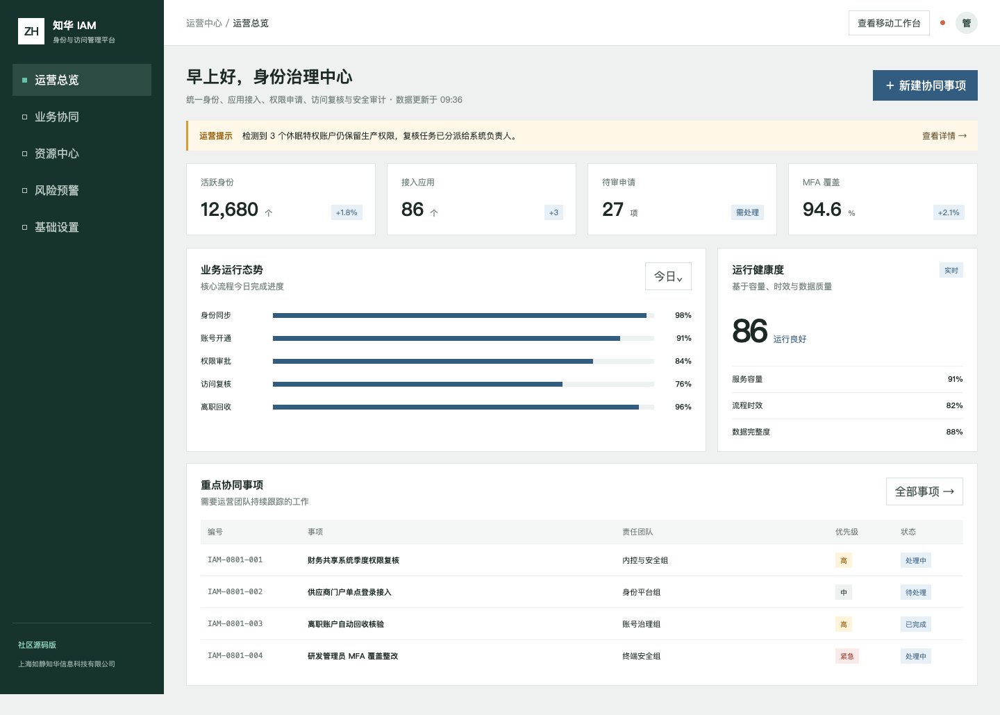
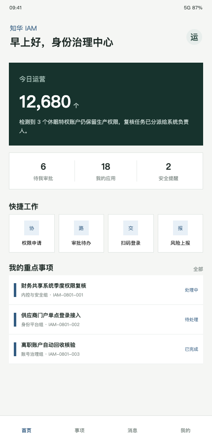

<div align="center">

# ZhuaTech IAM

### 知华身份与访问管理平台 · 社区源码版

[官方网站](https://www.zhuatech.cn/) · [功能范围](#功能范围) · [本地运行](#本地运行) · [使用许可](#使用许可) · [咨询合作](#咨询合作)

</div>

## 企业深化能力（2026-08）

新增多租户身份治理、MFA 特权门禁、职责分离（SoD）、访问申请审批、授权回收/到期失效、乐观锁与审计事件。详细状态机与生产边界见 [企业深化说明](docs/ENTERPRISE_DEEPENING.md)。

> 版权所有 © 2026 上海如静知华信息科技有限公司。本工程仅限个人非商业学习、研究和技术交流；企业内部使用、生产部署、SaaS、交付、销售及其他商业行为均须取得书面授权。

## 项目定位

ZhuaTech IAM 面向企业统一身份和权限治理场景，演示从身份同步、应用接入、权限申请到季度访问复核、离职回收和安全审计的协同链路。工程采用 Java 21、Spring Boot、Vue 3 与 MySQL，提供管理端和响应式 H5 工作台。



<p align="center"><em>管理端：身份规模、应用接入、审批积压、MFA 覆盖和访问复核事项</em></p>



<p align="center"><em>用户端：权限申请、审批待办、应用入口和安全提醒</em></p>

## 功能范围

| 模块 | 当前能力 |
| --- | --- |
| 身份中心 | 身份总览、同步与离职回收样例 |
| 应用与权限 | 应用接入、权限申请、审批事项和角色治理 |
| 访问复核 | 孤立账户、休眠特权账户、MFA 与复核完成率评估 |
| 安全基线 | ADMIN/OPERATOR 权限隔离、接口鉴权、输入校验 |
| 多端体验 | 桌面管理端与响应式移动工作台 |

核心接口 `POST /api/admin/access-review` 返回风险分数、`PASS / REVIEW / REMEDIATE` 决策和整改建议。

## 工程结构

```text
zhuatech-iam/
├── backend/      Spring Boot 4 / Java 21 / Security / JPA
├── frontend/     Vue 3 / Vite / 管理端与 H5
├── docs/         API、架构与实际页面截图
├── compose.yaml  MySQL、后端和前端编排
└── LICENSE       个人非商业社区源码许可
```

## 本地运行

```bash
cp .env.example .env
docker compose up --build
```

访问 `http://localhost:8090`。演示账号为 `admin / admin123` 和 `operator / operator123`，仅供本地学习；联网部署前必须通过环境变量替换。

详见 [API 文档](docs/API.md) 与 [架构说明](docs/ARCHITECTURE.md)。

## 使用许可

本项目采用 **ZhuaTech Community Source License 1.0（个人非商业版）**，不是 OSI 认可的开源许可证。个人可免费学习、研究和非商业修改；未经上海如静知华信息科技有限公司书面授权，不得商用、企业生产使用、收费下载、外包交付、投标、SaaS 或品牌替换。以 [LICENSE](LICENSE) 为准。

## 咨询合作

知华科技（上海如静知华信息科技有限公司）提供商业授权、私有化部署、系统集成和深度开发定制服务。

- 官网：[https://www.zhuatech.cn/](https://www.zhuatech.cn/)
- 微信咨询：扫描下方任一二维码

<p align="center">
  
  &nbsp;&nbsp;&nbsp;&nbsp;
  
</p>

关键词：知华科技 IAM、身份与访问管理、统一身份认证、权限治理、访问复核、Java IAM、Spring Boot 权限系统、上海软件定制开发。

## 职责分离与冲突权限检查

新增 `POST /api/iam/insights/segregation-of-duties`，识别付款创建与审批、供应商创建与采购审批、用户管理与审计管理等冲突角色，并结合高权限 MFA、休眠身份和服务账号责任人输出 `ALLOW / REVIEW / SUSPEND / REVOKE_CONFLICT`。
